# GreenLife

## Bahasa Indonesia

### Tentang Proyek

GreenLife adalah aplikasi web frontend bertema gaya hidup sehat dan produk organik. Aplikasi ini dirancang untuk menghadirkan pengalaman digital yang rapi dan informatif bagi pengguna yang ingin menjelajahi produk organik, membaca artikel kesehatan, bergabung dengan komunitas, serta mengelola aktivitas akun seperti keranjang, pesanan, favorit, dan pengaturan profil.

### Tech Stack

- Vue 3
- Vite
- Vue Router 4
- SCSS / Sass
- SweetAlert2
- Vue SweetAlert2
- animate.css

### Fitur Utama

- Beranda dengan hero section dan highlight produk unggulan
- Katalog produk organik
- Halaman artikel / blog untuk konten edukatif
- Halaman komunitas dengan event, diskusi, dan proyek komunitas
- Halaman Tentang Kami
- Halaman Kontak
- Autentikasi login dan registrasi
- Keranjang belanja
- Daftar pesanan
- Produk favorit
- Pengaturan akun, keamanan, dan notifikasi
- Navigasi responsif untuk desktop dan mobile

### Status Pengembangan

Project ini masih berfokus pada sisi frontend. Beberapa fitur sudah interaktif menggunakan state lokal dan `localStorage`, tetapi belum seluruhnya terhubung ke backend atau database nyata.

Fitur yang masih belum selesai atau masih bersifat simulasi:

- Pencarian di header masih berupa placeholder
- Login sosial Google dan Facebook masih berupa notifikasi informasi
- Data produk, keranjang, favorit, pesanan, dan pengaturan masih menggunakan data statis atau state lokal
- Belum ada integrasi backend Laravel atau API nyata
- Beberapa tautan footer dan tombol CTA masih menggunakan `#` atau aksi dummy
- Fitur QR code untuk two-factor authentication masih berupa placeholder tampilan
- Beberapa aksi seperti detail produk, newsletter, dan beberapa interaksi lain masih simulasi

### Struktur Route

- `/` - Beranda
- `/produk` - Produk
- `/artikel` - Artikel / Blog
- `/komunitas` - Komunitas
- `/tentang` - Tentang Kami
- `/kontak` - Kontak
- `/keranjang` - Keranjang
- `/profil` - Profil pengguna
- `/auth` - Login / registrasi
- `/pesanan` - Pesanan saya
- `/favorit` - Favorit
- `/pengaturan` - Pengaturan akun

### Instalasi

```bash
npm install
npm run dev
```

### Akun Demo Login

Gunakan akun berikut untuk mencoba alur login:

- `diana.sari@greenlife.test` / `Greenlife123!`
- `admin@greenlife.test` / `Admin123!`

Kedua akun ini disimpan sebagai demo lokal di frontend.

### Script Tersedia

- `npm run dev` - Menjalankan project dalam mode development
- `npm run build` - Build project untuk production
- `npm run preview` - Menjalankan preview hasil build

### Catatan Portfolio

Sistem ini dikembangkan dengan bantuan AI.

### Screenshots
<p align="center">
  <a href="#cover">
    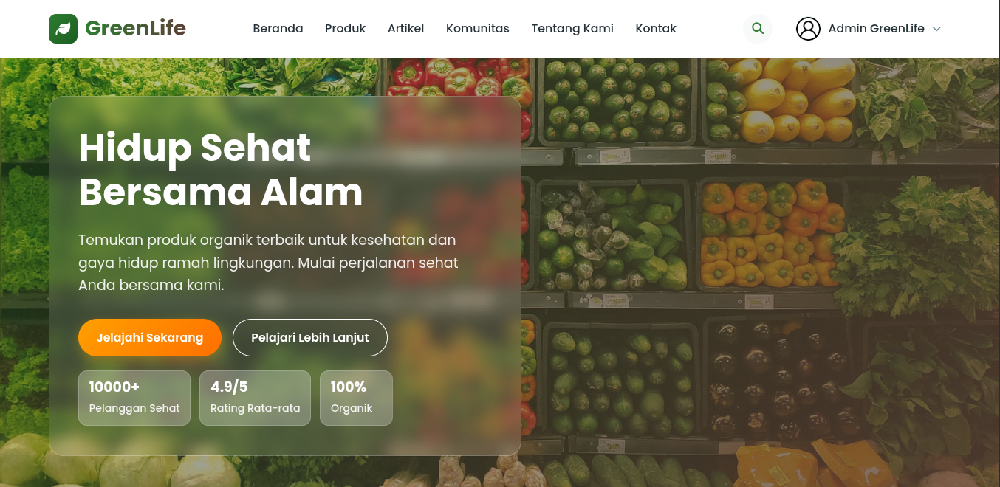
  </a>
  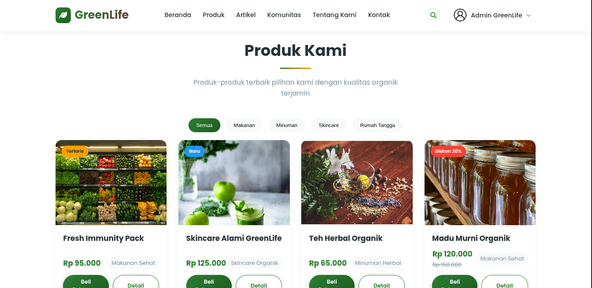
  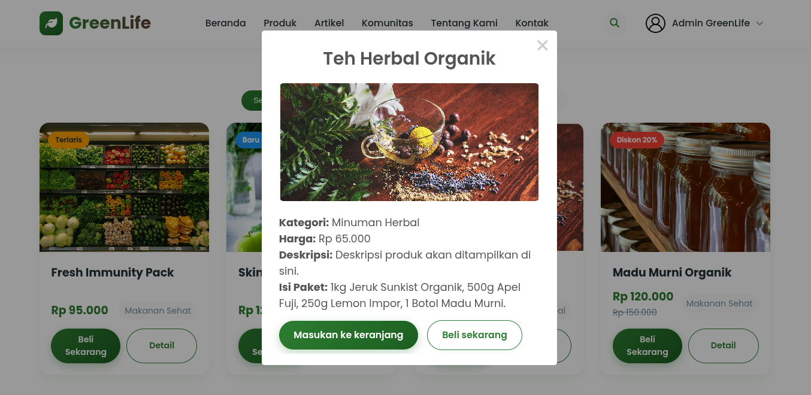
  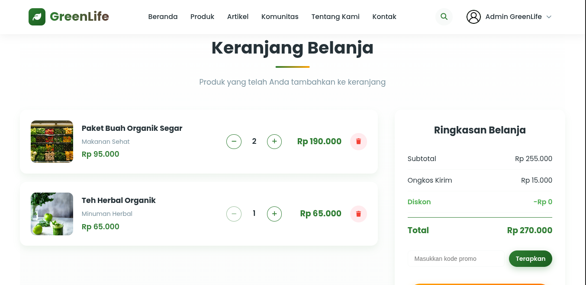
  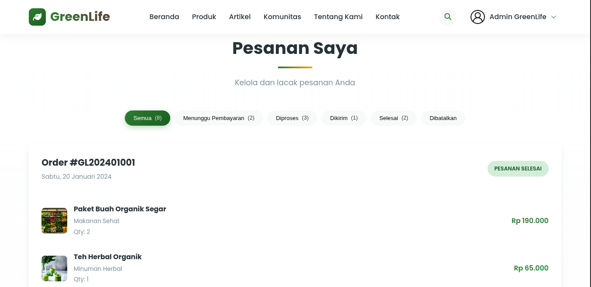
  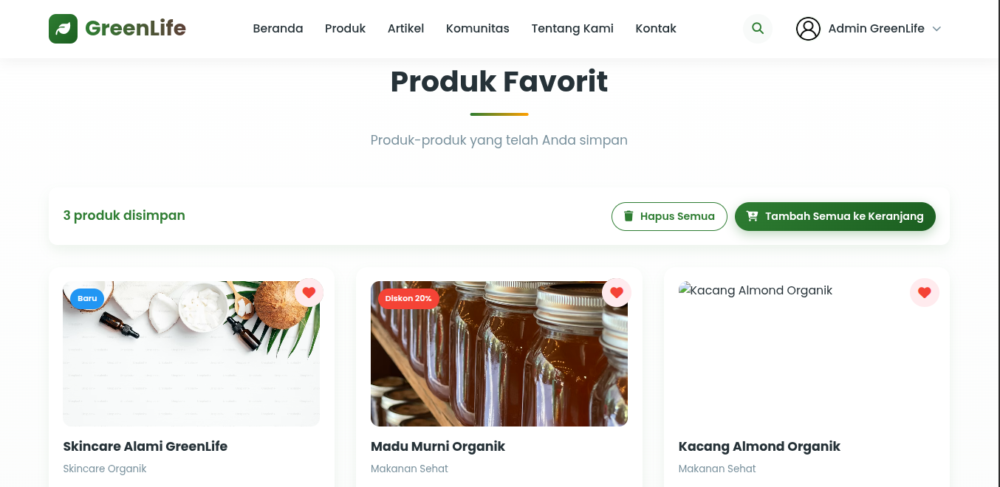
  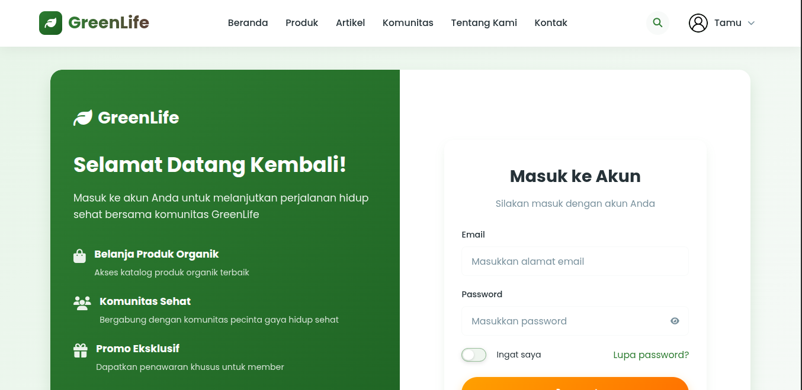
  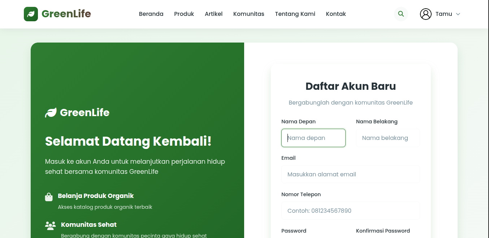
  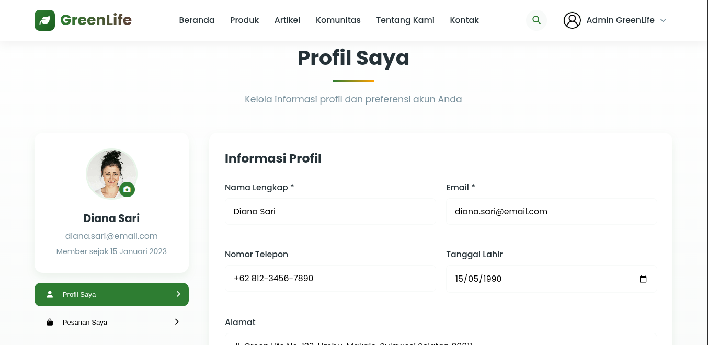
  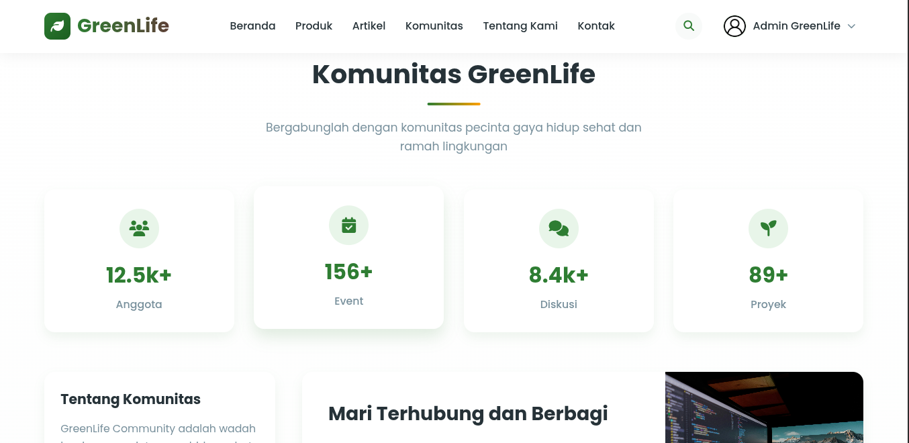
  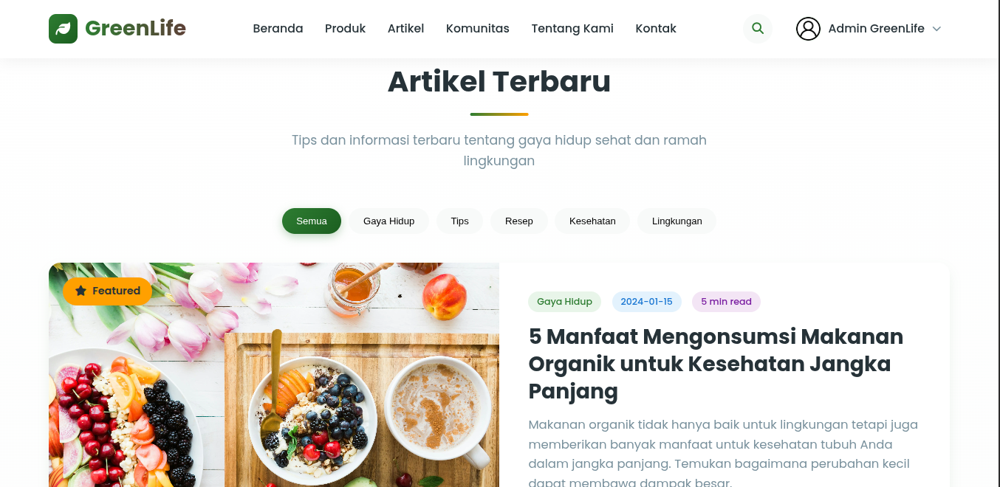
  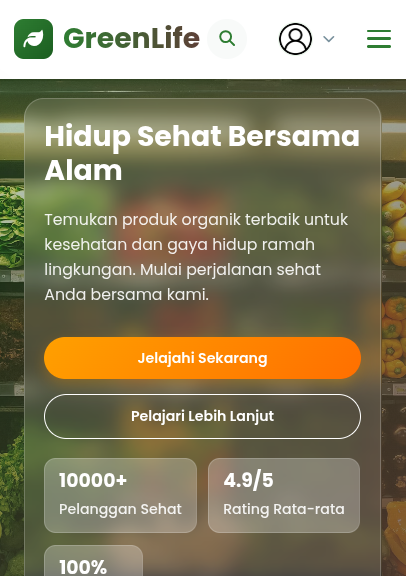
</p>
---

## English

### About the Project

GreenLife is a frontend web application focused on healthy lifestyle and organic products. The project is designed to provide a clean and informative digital experience for users who want to browse organic products, read health articles, join a community, and manage account-related activities such as cart, orders, favorites, and profile settings.

### Tech Stack

- Vue 3
- Vite
- Vue Router 4
- SCSS / Sass
- SweetAlert2
- Vue SweetAlert2
- animate.css

### Key Features

- Home page with hero section and featured products
- Organic product catalog
- Articles / blog page for educational content
- Community page with events, discussions, and community projects
- About page
- Contact page
- Login and registration authentication
- Shopping cart
- Order list
- Favorite products
- Account, security, and notification settings
- Responsive navigation for desktop and mobile

### Development Status

This project currently focuses on the frontend. Some features are interactive using local state and `localStorage`, but not all of them are connected to a real backend or database yet.

Features that are still incomplete or simulation-based:

- Header search is still a placeholder
- Google and Facebook social login are informational only
- Product, cart, favorites, orders, and settings data are still static or locally managed
- No Laravel backend or real API integration yet
- Some footer links and CTA buttons still use `#` or dummy actions
- The QR code feature for two-factor authentication is still a visual placeholder
- Some actions such as product details, newsletter, and other interactions are still simulated

### Route Structure

- `/` - Home
- `/produk` - Products
- `/artikel` - Articles / Blog
- `/komunitas` - Community
- `/tentang` - About
- `/kontak` - Contact
- `/keranjang` - Cart
- `/profil` - User profile
- `/auth` - Login / registration
- `/pesanan` - Orders
- `/favorit` - Favorites
- `/pengaturan` - Settings

### Installation

```bash
npm install
npm run dev
```

### Demo Login Accounts

Use the following accounts to test the login flow:

- `diana.sari@greenlife.test` / `Greenlife123!`
- `admin@greenlife.test` / `Admin123!`

These accounts are stored locally as frontend demo data.

### Available Scripts

- `npm run dev` - Start the development server
- `npm run build` - Build the project for production
- `npm run preview` - Preview the production build

### Portfolio Note

This system was developed with the help of AI.
